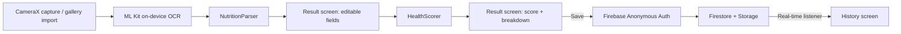

# NutriScanner

Point your camera at a nutrition facts panel and get a transparent, documented health score in seconds.

## Badges


The CI badge reflects the real GitHub Actions workflow in this repo. It won't show a passing run until the workflow has actually executed against a pushed commit with a generated Gradle wrapper jar (see Setup below).

## Table of contents

- [Overview](#overview)
- [Demo](#demo)
- [Architecture](#architecture)
- [Tech stack](#tech-stack)
- [Features](#features)
- [Setup and installation](#setup-and-installation)
- [Usage](#usage)
- [Testing](#testing)
- [Benchmark and results](#benchmark-and-results)
- [Known limitations](#known-limitations)
- [AI notes](#ai-notes)
- [License](#license)

## Overview

NutriScanner reads a nutrition facts label with on-device OCR, parses the raw text into structured fields, and scores the product using a formula documented in full in `docs/scoring_methodology.md`. Everything runs on-device except the scan history sync, which uses Firestore so a user's past scans update live across sessions.

## Demo

Screen recording and screenshots go here once the app has run on a device. This repo was assembled in an environment without Android SDK or emulator access, so there's no demo capture yet. See `docs/known_limitations.md` for the full list of what hasn't been run.

## Architecture



Full module breakdown, including why the parser and scorer are kept dependency-free from Android, is in `docs/architecture.md`.

## Tech stack

| Layer | Technology | Why chosen |
|---|---|---|
| UI | Jetpack Compose + Material 3 | Declarative UI matches the scan -> result -> history flow well, and state-driven screens make the editable result fields straightforward |
| Camera | CameraX | Handles device variation in camera APIs so capture doesn't need per-device tuning |
| OCR | ML Kit Text Recognition (on-device) | No network round trip, works offline, no per-scan cost |
| Backend | Firebase Firestore + Storage + Anonymous Auth | Real-time sync and offline persistence come from the SDK itself, and anonymous auth avoids account creation friction for a demo app |
| Language | Kotlin | Standard for modern Android, coroutines make the OCR -> parse -> score pipeline read linearly despite being async |
| Tests | JUnit 4 | Parser and scorer are pure Kotlin, so plain JVM unit tests cover them without a device |

## Features

- Camera capture with CameraX, plus a gallery-import fallback that works even without camera permission granted.
- On-device OCR via ML Kit, no network call during recognition.
- Tolerant nutrition-panel parser that handles common OCR misreads (0/O, 1/l, g/9 confusion, inconsistent spacing, decimal commas).
- Any field the parser can't confidently read is left blank for manual entry rather than guessed.
- Transparent scoring formula with a letter band (A-E) and full numeric breakdown, documented in `docs/scoring_methodology.md`.
- Scan history synced to Firestore in real time, with built-in offline support.
- Editable result screen: correct any field before confirming a score.

## Setup and installation

1. Clone the repo:
   ```
   git clone https://github.com/YOUR_GITHUB_USERNAME/nutriscanner-android.git
   cd nutriscanner-android
   ```
2. Generate the Gradle wrapper jar. It isn't checked into this repo (see `docs/known_limitations.md` for why); this is a one-time step if you have Gradle installed locally:
   ```
   gradle wrapper --gradle-version 8.7
   ```
3. Create a free Firebase project at https://console.firebase.google.com, add an Android app to it with package name `com.nutriscanner.app`, and download the generated `google-services.json`.
4. Copy your downloaded file into place. It's gitignored, so it never gets committed:
   ```
   cp ~/Downloads/google-services.json app/google-services.json
   ```
5. In the Firebase console, enable Anonymous sign-in under Authentication, and create a Firestore database in test mode (or write real security rules; see `docs/known_limitations.md`).
6. Build:
   ```
   ./gradlew assembleDebug
   ```

No Maven/Gradle installation is required beyond the one-time wrapper generation in step 2. Everything else runs through `./gradlew`.

## Usage

1. Launch the app and grant camera access when prompted (or skip it and use gallery import instead).
2. On the scan screen, point the camera at a nutrition facts panel and tap Capture, or tap "Choose from gallery" to pick an existing photo.
3. The result screen shows every field the parser extracted. Fill in or correct anything that's blank or wrong, then tap "Compute score."
4. Review the band and point breakdown, optionally name the product, and tap "Save to history."
5. The history tab shows every saved scan, updating live if a scan is added from another session signed into the same anonymous identity.

## Testing

Parser and scoring logic have full unit test coverage, no device or emulator required:

```
./gradlew testDebugUnitTest
```

- `NutritionParserTest.kt`: a clean well-formatted label, a label with realistic OCR noise (0/O, g/9, m/mg misreads, spacing), a label with a field missing entirely, decimal-comma normalization, and a check that a saturated-fat line doesn't also get read as total fat.
- `HealthScorerTest.kt`: a high-sugar/low-fiber synthetic profile that should score poorly, a high-fiber/low-sugar/low-sodium profile that should score well, the same favorable profile expressed at a different serving size to check per-100g normalization, and a check that scoring an incomplete `NutritionFacts` throws rather than silently producing a wrong score.

CI runs `ktlintCheck`, `testDebugUnitTest`, and `assembleDebug` on every push once the wrapper jar from Setup step 2 is committed.

## Benchmark and results

Reference cases from the test suite, since a general-purpose product benchmark isn't meaningful for a formula validated against synthetic profiles rather than a product database:

| Profile | Calories/100g | Sugar/100g | Sat fat/100g | Sodium/100g | Fiber/100g | Protein/100g | Numeric score | Band |
|---|---|---|---|---|---|---|---|---|
| High sugar, low fiber | 450 | 55g | 8g | 380mg | 1g | 2g | 17 | E |
| High fiber, low sugar, low sodium | 90 | 2g | 0.3g | 40mg | 6g | 5g | -7 | A |

Full formula and reasoning for every threshold: `docs/scoring_methodology.md`.

## Known limitations

Covered in full, and honestly, in `docs/known_limitations.md`. Highlights: the parser is line-based so a field split across two OCR lines won't match, the scoring formula omits the fruit/vegetable/nut component real Nutri-Score uses, and no Firestore security rules are included yet.

## AI notes

See AI_NOTES.md for a full breakdown of how AI tools were used during development.

## License

MIT. See `LICENSE`.
