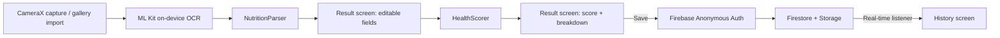

# Architecture

## Data flow



## Module layout

- `ocr/` wraps ML Kit's on-device text recognizer. It takes a bitmap and
  returns the raw recognized text block; it knows nothing about nutrition
  facts specifically.
- `parser/` turns that raw text into a `NutritionFacts` value, tolerant of
  common OCR misreads (see `known_limitations.md` for what it can't
  recover from). Pure Kotlin, no Android dependencies, fully unit-testable.
- `scoring/` turns a complete `NutritionFacts` into a `ScoreResult`. Also
  pure Kotlin. The full formula lives in `scoring_methodology.md`.
- `data/` is the Firestore/Storage boundary: `ScanRecord` (the persisted
  shape) and `ScanRepository` (reads/writes/real-time listener).
- `auth/` wraps Firebase Anonymous Auth behind a two-method interface
  (`currentUid`, `ensureSignedIn`).
- `ui/` holds the three Compose screens (scan, result, history) plus the
  view models that connect them to the modules above.

## Why this split

The parser and scorer are the two pieces with actual logic worth getting
right and testing thoroughly, so they're kept free of any Android or
Firebase dependency. Everything Android-specific (camera, OCR client,
Firestore, Compose) sits in a thin layer around them. That's also why the
unit tests in `app/src/test` don't need a device or emulator: they're
exercising plain Kotlin classes.

## State flow between screens

`ScanFlowViewModel` is shared between the scan and result screens (created
once at the nav host level) so the extracted `NutritionFacts` survives the
navigation hop without being serialized into nav arguments. `HistoryViewModel`
is separate and owns its own Firestore listener, started when the history
screen is first composed.

## Firebase project structure

```
users/{uid}/scans/{scanId}
```

Every scan is scoped under the signed-in (anonymous) user's uid. This keeps
Firestore security rules simple, a user can only read and write documents
under their own uid, and avoids any cross-user query. Label photos, when
saved, live in Storage at the parallel path `users/{uid}/scans/{scanId}.jpg`.
